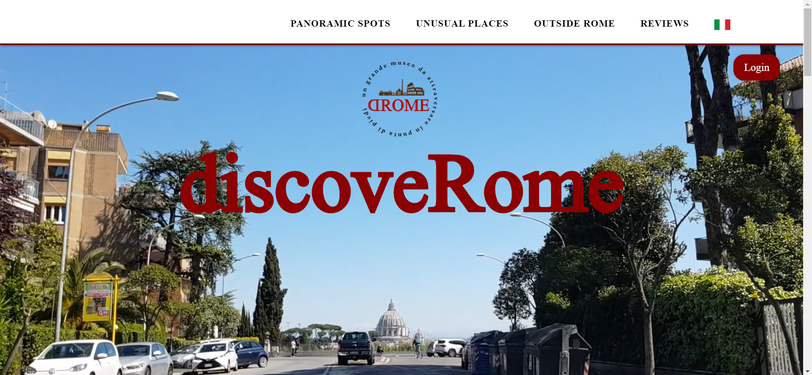
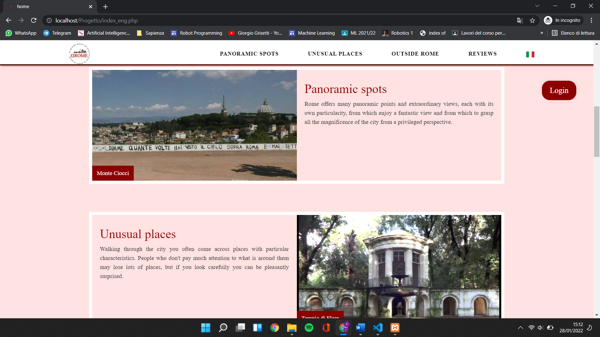
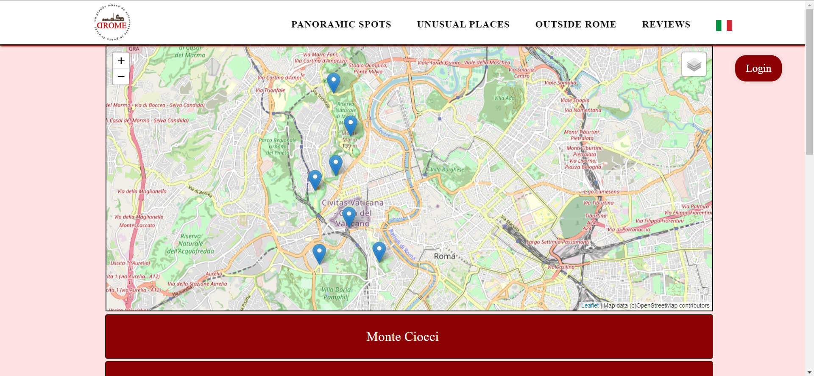
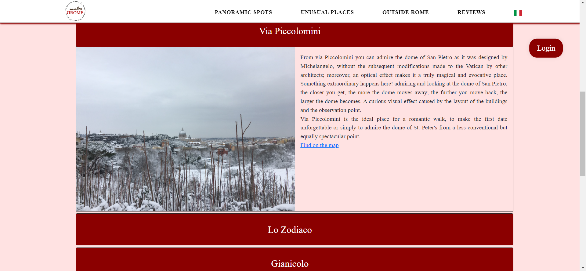
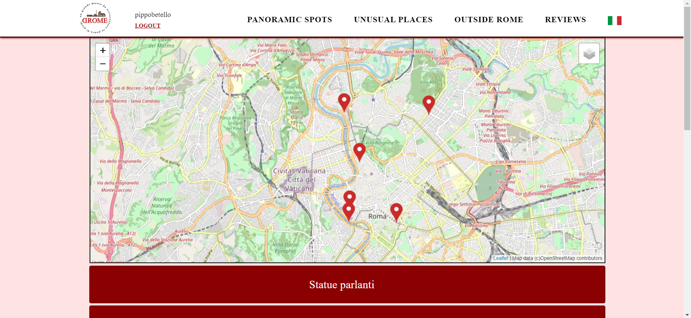
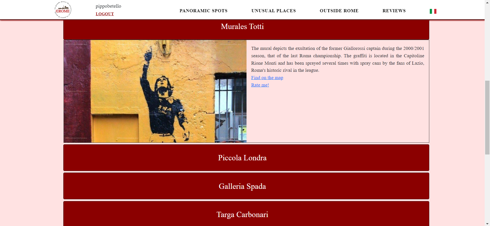
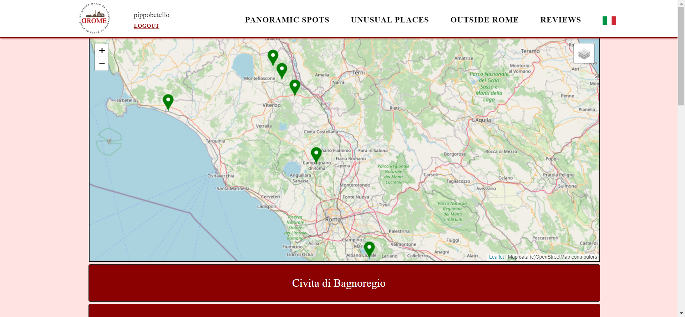
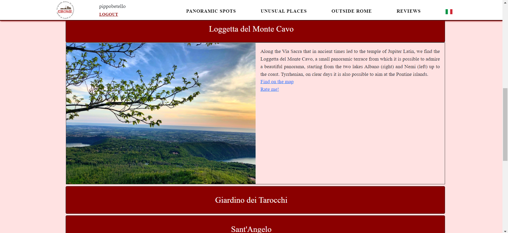

# :man_technologist::woman_technologist::man_technologist:LTW Project
Group project for the course [web languages and technologies](http://www.diag.uniroma1.it/rosati/ltw/) (only in Italian sorry) 2021 edition, Sapienza Univerisity of Rome. 
Developed with ***@JacopoBrunetti*** and ***@MichelaCattabriga***
## 📜Short Description
The goal of our project is to create a website that collects unusual places in Rome and in the Lazio region. In fact we divide the website into three categories: **panoramic spots**, **unusual places** and **outside Rome**. In every page of a category there is a map with markes on the places: we developed it using leaflet. Furthermore, we add the possibility to write review about a place and send us suggestions about new places. 
### 🏠HomePage
*index.php, index_eng.php, home.css e home.js* 
These are files relating to the home page(Italian and English version) where there is a video, descriptions of the site's categories, a slideshow with some reviews and a presentation of the work team. In all sections there are several animations created with CSS.  

### 🔭Panoramic Spots
*viste_ita.php, viste_eng.php, mappa.css, viste_ita.js, viste_eng.js* 
These are the files relating to the panoramic spot page(Italian and English version) where there is a map, and the several slidetoggle buttons where inside there is a slideshow and a description of the place.  

### 🗿Unusual Places
*luoghi_ita.php, luoghi_eng.php, mappa.css, luoghi_ita.js, luoghi_eng.js* 
These are the files relating to the unusual places page(Italian and English version) where there is a map, and the several slidetoggle buttons where inside there is a slideshow and a description of the place.  

### 🏕️Outside Rome
*fuori_ita.php, fuori_eng.php, mappa.css, fuori_ita.js, fuori_eng.js* 
These are the files relating to the outside Rome page(Italian and English version) where there is a map, and the several slidetoggle buttons where inside there is a slideshow and a description of the place.  

### 📁Other Files
*login.php, logout.php, registrazione.php* 
Files necessary to the sign in of an user in the Database. 
*invia_recensione.php, recensione.php, stamparec.php, tabella.css* 
It is possible submit a review using the appropriate form using two methods (select editable or not depending on how you got to that page). The last .php file prints all the reviews in the DB. 
*suggerimento.php* 
It allows you to send a suggested place to our email (in the footer). It was done by editing some files inside XAMPP.
*DataBase* 
Where there is the code used for the database.  
## 📝Info:
For any doubt or clarification send me an [email](mailto:betello.1835108@studenti.uniroma1.it?subject=[GitHub_LTW]). 
**Further note**: the above material is for an univerisity project. Because of that everything is **UNCOMMENTED**
                                                
