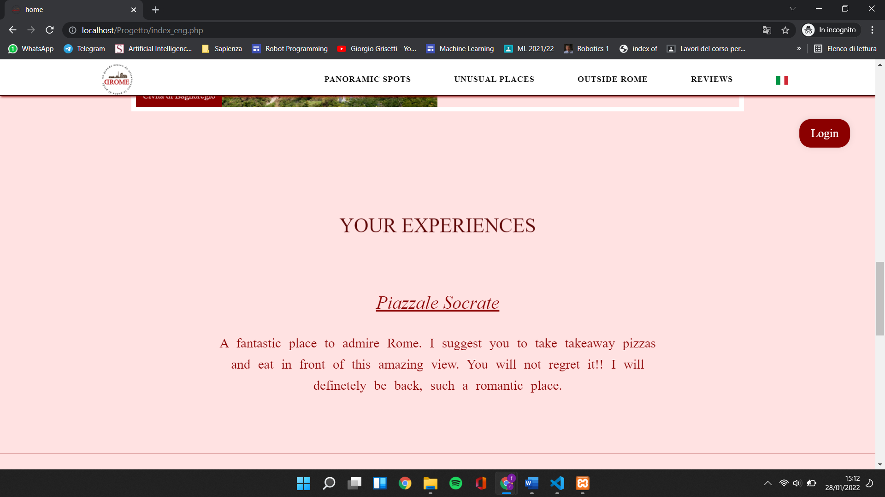

# :man_technologist::woman_technologist::man_technologist:LTW Project
Group project for the course [web languages and technologies](http://www.diag.uniroma1.it/rosati/ltw/) (only in Italian sorry) 2021 edition, Sapienza Univerisity of Rome. 
Developed with ***@JacopoBrunetti*** and ***@MichelaCattabriga***
## Short Description
The goal of our project is to create a website that collects unusual places in Rome and in the Lazio region. In fact we divide the website into three categories: **panoramic spots**, **unusual places** and **outside Rome**. In every page of a category there is a map with markes on the places: we developed it using leaflet. Furthermore, we add the possibility to write review about a place and send us suggestions about new places. 
### HomePage
*index.php, index_eng.php, home.css e home.js* 
These are files relating to the two home pages where there is a video, descriptions of the site's categories, a slideshow with some reviews and a presentation of the work team. In all sections there are several animations created with CSS.  

